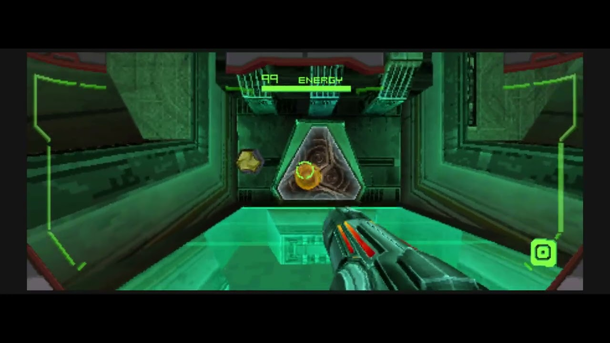

# MetroidPrimeHuntersRecomp

> **Public alpha - bugs are expected.** This is an early Metroid Prime Hunters
> recompilation release built on [ndsrecomp](https://github.com/mstan/ndsrecomp).
> It is not a finished port. Expect rough edges, crashes, hangs, rendering or
> audio issues, input quirks, networking failures, and possible desyncs. Testing,
> issues, and PRs are welcome.
>
> **Early access multiplayer support.** Wiimmfi multiplayer is tentative, but
> early testing has successfully reached an in-game match between two different
> players. Treat online play as experimental while broader stability and desync
> behavior are still being tested.

MetroidPrimeHuntersRecomp runs the USA revision-0 release of **Metroid Prime
Hunters** as a native recompilation target. You provide your own legally
obtained ROM. No Nintendo ROM, BIOS, firmware, save data, or generated
ROM-derived source is distributed.

## Gameplay Preview

Click the image to watch the gameplay preview on YouTube.

## Current Release

Latest release:
**[v0.4.9-alpha](https://github.com/mstan/MetroidPrimeHuntersRecomp/releases/tag/v0.4.9-alpha)**.

Downloads:

- Windows:
  `MetroidPrimeHuntersRecomp-windows-x64-v0.4.9.zip`
- Linux:
  `MetroidPrimeHuntersRecomp-linux-v0.4.9-x86_64.AppImage`

This is the first release line in the ndsrecomp ecosystem and it is still very
early. Campaign entry, widescreen output, Prime-style controls, gamepad support,
and Wiimmfi lobby connectivity have all seen active bring-up, but this should
still be treated as an alpha test build rather than a polished game release.

New in v0.4.9: some low-polygon map/overworld/tutorial transition views are
centered to avoid showing split widened side content, while normal gameplay
keeps adaptive widescreen.

Also new since v0.4.8: alpha diagnostics are controlled by a default-on
`Diagnostics` option on the Mods page. When enabled, the launcher keeps
coverage, performance, and dispatch-miss logs together in its `diagnostics`
folder so testers can attach them to bug reports. Disable `Diagnostics` if you
do not want those files generated.

This release also keeps the v0.4.7 Prime Controls focus fix, the v0.4.5 Linux
AppImage ROM picker fallback, the v0.4.4 Steam Deck / older-glibc AppImage
baseline, the v0.4.3 launcher fullscreen/layout forwarding and HD renderer
fixes, the v0.4.2 public Tab turbo default-off fix, and the v0.4.1 Nintendo WFC
reconnect and same-machine local Multi-Card runtime-bank fixes.
The v0.4.0 HD Rendering mod is still available on the Mods page: it raises the
3D engine above one sample per DS pixel (up to 4x) and filters decoded
textures, while the 2D layers stay native. It is off by default; enable it
under Mods and pick the internal resolution and texture upscaling that suit
your GPU.

## Quick Start

Windows:

1. Download and fully extract the `v0.4.9-alpha` Windows ZIP.
2. Put your own Metroid Prime Hunters USA revision-0 `.nds` ROM next to
   `MetroidPrimeHuntersRecomp.exe`.
3. Run `MetroidPrimeHuntersRecomp.exe` and press Play.

Linux:

1. Download the `v0.4.9-alpha` AppImage.
2. Put your own Metroid Prime Hunters USA revision-0 `.nds` ROM next to the
   AppImage.
3. Run the AppImage.

The current release can use the built-in FreeBIOS + generated firmware path, so
retail DS BIOS and firmware dumps are not required for the default no-dump
startup path. If you choose to use your own BIOS/firmware dumps, they must be
from hardware you own and must match the hashes listed in the release's
`bios/README.txt`.

## Required ROM

Only this ROM revision is supported:

| field | value |
|---|---|
| title | `MP HUNTERS` |
| game code | `AMHE` |
| region/revision | USA revision 0 |
| size | 64 MiB |
| SHA-1 | `90164d1ac127ee5f9815ea4ae7de798c7b5fc629` |
| SHA-256 | `7d0a98ff98e1b7c985d1f3d89b01730af1b2115061a4dfea847612d217a8b855` |

If your ROM does not match, the launcher/runner should reject it.

## What Works

- Boots the supported ROM through the ndsrecomp runner.
- Reaches Metroid Prime Hunters gameplay in tested routes.
- Includes an adaptive 21:9 upper-screen widescreen option.
- Includes Prime-style keyboard and mouse controls.
- Includes full remappable gamepad bindings in the launcher.
- Supports mouse-driven touchscreen input.
- Can authenticate through Wiimmfi and reach a Friends and Rivals lobby in
  validated flows.
- Can reconnect to Nintendo WFC more than once in one launch in the validated
  reconnect probe.
- Supports same-machine local Multi-Card play in validated two-instance
  sessions.

## Known Limits

- This is an alpha. Bugs, crashes, hangs, graphical issues, audio issues, and
  gameplay problems are expected.
- Gameplay coverage is incomplete. Do not assume the campaign is fully
  validated from start to finish.
- Widescreen is still being audited. Some scenes, effects, HUD placement,
  movies, fades, or screen-routing behavior may be wrong.
- Online play is experimental. Early Wiimmfi testing has successfully reached
  an in-game match between two different players, but no match is guaranteed to
  connect, stay connected, or avoid desync. See "Online Play" below.
- Local wireless play is experimental and has only been validated between two
  instances on one machine.
- Save behavior and settings are still part of early release testing. Keep
  backups of anything you care about.

## Controls

Prime Controls are enabled by default.

Keyboard and mouse defaults:

- `WASD`: move
- Mouse: aim
- Mouse 1 / Mouse 2: fire / scan-fire
- `Space`: jump
- `Left Ctrl`: morph ball
- `Left Shift`: boost / map zoom
- `C`: scan visor
- `F`: OK
- `Q` / `E`: scan-message arrows
- `V`: menu
- Mouse 4: missiles
- Mouse 5: beam
- `1` through `6`: subweapons
- `Tab`: virtual stylus

Gamepad defaults:

- Left stick: move and menu D-pad
- Right stick: aim
- `RT` / `LT`: shoot / scan-fire
- `A`: jump
- `B`: morph ball
- `X`: missile
- `Y`: UI OK
- `LB` / `RB`: beam / boost or zoom
- `R3`: scan visor
- D-pad left/right: scan-message arrows
- `Start`: menu

Keyboard, mouse, and gamepad bindings are editable from the launcher Mods page.

## Online Play

Nintendo WFC / Wiimmfi support is experimental, but it does work: the game
authenticates against the live Wiimmfi servers over the real internet, and a
**complete online match has been played end to end** — two consoles in one
Friends and Rivals game, both players in the arena and visibly moving, with
player state streaming between them for the duration of the match.

Also validated: the Wi-Fi connection test passes repeatedly, the connection is
preconfigured out of the box (the generated firmware already carries the access
point, so the Nintendo WFC setup menu is not required before playing online),
and friends added to your roster persist across restarts.

**What is not yet validated: playing against someone on a different machine.**
The match above was two instances on one computer. Because they shared a public
IP address, the DS's own matchmaking took its same-network shortcut and never
performed NAT negotiation — the step real internet play between two households
depends on. Expect remote play to need more work.

The launcher keeps the console firmware profile in
`%APPDATA%\MetroidPrimeHuntersRecomp`. Wi-Fi settings, console/game-card
pairing, and WFC updates survive both the in-game system shutdown flow and a
normal window close. Confirming the WFC settings shutdown prompt closes the
application automatically.

Note that your console identity (in `%APPDATA%`) and your cartridge save (kept
next to the ROM) form a matched pair: Nintendo WFC ties a game card to a
console. If you move or delete one without the other, the game will report that
the WFC ID from the Nintendo DS and the Game Card do not match. Keep them
together, or back them up together.

The v0.4.9 patch keeps the v0.4.2 public Tab turbo default disabled, and also
includes launcher fullscreen/layout argument forwarding plus several compute
renderer HD/Intel compatibility paths from v0.4.3. The v0.4.1 reconnect fix
remains included: the validated reconnect probe reaches Nintendo WFC three
times in one run without error 52200. Online play remains experimental beyond
that and may still disconnect or desync.

The Wi-Fi implementation is built on
[melonDS](https://github.com/melonDS-emu/melonDS)'s Wi-Fi work in the shared
ndsrecomp runner. Full credit to the melonDS team for the Wi-Fi controller,
emulated access point, and network backend foundation.

## Credits

- [melonDS](https://github.com/melonDS-emu/melonDS): Wi-Fi implementation
  foundation used by the shared ndsrecomp runner.
- [melonPrimeDS](https://github.com/makinori/melonPrimeDS): reference for the
  Prime-style keyboard/mouse controls and touchscreen-helper behavior.
- [MphRead](https://github.com/NoneGiven/MphRead): Metroid Prime Hunters file
  format and behavior reference.

See the ndsrecomp
[`THIRD_PARTY_ATTRIBUTION.md`](https://github.com/mstan/ndsrecomp/blob/main/THIRD_PARTY_ATTRIBUTION.md)
for provenance and licensing details for shared runtime components.

## Developers

This README is intentionally player-facing. Development notes, validation
history, and bring-up details live in [`docs/BRINGUP.md`](docs/BRINGUP.md).

The original code in this repository is MIT licensed. Metroid Prime Hunters,
Nintendo DS firmware/BIOS images, ROMs, saves, and all derived game data remain
the property of their respective copyright holders and are not distributed.

---

  <b>R.A.I.D. — Retro AI Development</b> · a Discord for AI-assisted retro reverse-engineering, decomp &amp; recomp

  

